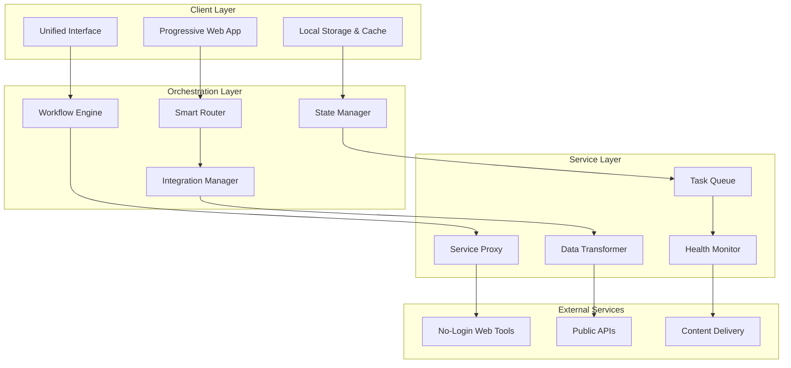
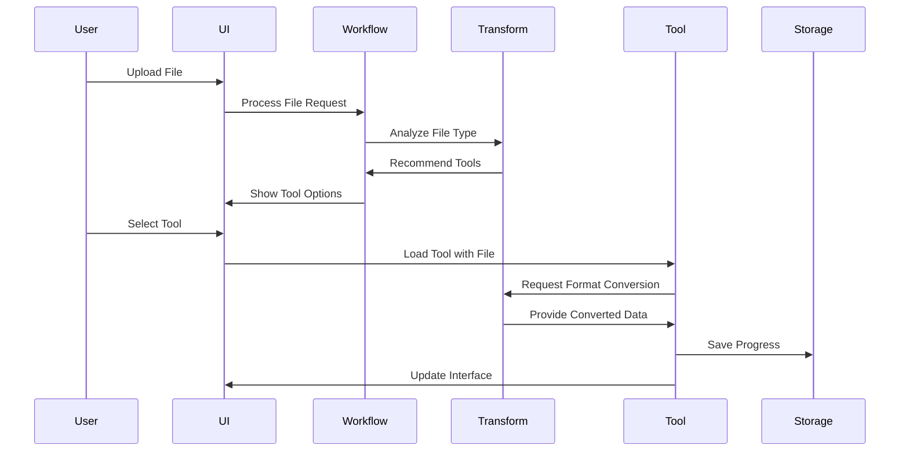

# Design Document

## Overview

The No-Login App Combinations platform is a revolutionary web-based ecosystem that intelligently integrates existing no-login web tools into unified, powerful applications. Rather than reinventing functionality, this platform creates value through seamless integration, providing users with comprehensive workflows that eliminate the friction of switching between multiple services.

The platform consists of eight specialized application suites, each targeting specific user workflows: Creative Content Studio, Developer Workflow Hub, Document Processing Pipeline, Media Production Suite, Privacy-First Communication Hub, Educational Learning Platform, Business Productivity Suite, and Gaming & Entertainment Hub.

The core innovation lies in the intelligent orchestration layer that manages tool integration, data flow between services, and user experience continuity while maintaining the no-login philosophy that makes these tools accessible to everyone.

## Architecture

### High-Level Architecture

The platform follows a modular, microservices-inspired architecture with the following key components:



### Core Components

#### 1. Progressive Web App Shell
- **Purpose**: Provides the foundational application structure and offline capabilities
- **Technology**: Service Workers, Web App Manifest, IndexedDB
- **Features**: 
  - Offline-first architecture with intelligent caching
  - App-like experience with native-feeling navigation
  - Background sync for queued operations
  - Push notifications for completed tasks

#### 2. Unified Interface Layer
- **Purpose**: Presents a consistent, intuitive interface across all application suites
- **Technology**: React/Vue.js with component library, CSS Grid/Flexbox
- **Features**:
  - Adaptive layouts that respond to content and screen size
  - Contextual toolbars that change based on active workflow
  - Drag-and-drop file handling with preview capabilities
  - Real-time collaboration indicators

#### 3. Smart Router & Workflow Engine
- **Purpose**: Manages navigation between tools and orchestrates complex workflows
- **Technology**: Custom routing with state persistence, WebWorkers for background processing
- **Features**:
  - Intelligent tool recommendation based on file types and user actions
  - Workflow templates for common task sequences
  - Automatic data format conversion between tools
  - Undo/redo functionality across tool boundaries

#### 4. Integration Manager
- **Purpose**: Handles communication with external no-login tools and services
- **Technology**: Proxy servers, CORS handling, iframe sandboxing, postMessage API
- **Features**:
  - Secure iframe embedding with controlled communication
  - API abstraction layer for consistent data exchange
  - Automatic retry logic with exponential backoff
  - Service health monitoring and fallback options

#### 5. Data Transformer
- **Purpose**: Converts data between different formats required by various tools
- **Technology**: WebAssembly for performance-critical operations, streaming processing
- **Features**:
  - Real-time format conversion (images, documents, code)
  - Lossless data preservation during transformations
  - Batch processing capabilities for multiple files
  - Memory-efficient streaming for large files

## Components and Interfaces

### Application Suite Components

#### Creative Content Studio
```typescript
interface CreativeStudioWorkspace {
  canvas: CanvasManager;
  layers: LayerManager;
  tools: ToolPalette;
  assets: AssetLibrary;
  export: ExportManager;
}

class CanvasManager {
  // Manages multiple canvas instances for different editing tools
  createCanvas(type: 'raster' | 'vector' | 'animation'): Canvas;
  switchTool(toolId: string, canvas: Canvas): void;
  syncChanges(canvas: Canvas): Promise<void>;
}
```

**Integration Points:**
- PhotoPea: Embedded iframe with custom toolbar integration
- SVG-Edit: Direct SVG manipulation with real-time preview
- Coolors: API integration for palette generation and application
- TinyPNG: Automatic optimization pipeline for exports

#### Developer Workflow Hub
```typescript
interface DeveloperWorkspace {
  editor: CodeEditor;
  terminal: VirtualTerminal;
  preview: LivePreview;
  tools: DevToolsPanel;
  deployment: DeploymentManager;
}

class CodeEditor {
  // Manages multiple editor instances with syntax highlighting
  createProject(template: ProjectTemplate): Project;
  runCode(language: string, code: string): Promise<ExecutionResult>;
  optimizeCode(code: string, options: OptimizationOptions): string;
}
```

**Integration Points:**
- Repl.it: Embedded execution environment with custom UI
- CodePen: Live preview integration with hot reloading
- GTmetrix: Automated performance testing pipeline
- jsonstore.io: Backend service integration for data persistence

#### Document Processing Pipeline
```typescript
interface DocumentWorkspace {
  editor: DocumentEditor;
  converter: FormatConverter;
  collaboration: CollaborationManager;
  sharing: SharingManager;
}

class DocumentEditor {
  // Unified interface for different document types
  createDocument(type: 'markdown' | 'latex' | 'spreadsheet'): Document;
  convertFormat(doc: Document, targetFormat: string): Promise<Document>;
  enableCollaboration(doc: Document): CollaborationSession;
}
```

**Integration Points:**
- HackMD: Real-time collaborative editing with conflict resolution
- Pandoc: Server-side conversion with progress tracking
- Cloud Convert: Fallback conversion service with queue management

### Data Flow Architecture

#### File Processing Pipeline


#### Cross-Tool Data Synchronization
```typescript
interface DataSyncManager {
  // Manages data consistency across multiple tools
  syncData(sourceToolId: string, targetToolId: string, data: any): Promise<void>;
  createSnapshot(workspaceId: string): Promise<Snapshot>;
  restoreSnapshot(snapshotId: string): Promise<void>;
  resolveConflicts(conflicts: DataConflict[]): Promise<Resolution>;
}
```

## Data Models

### Core Data Structures

#### Workspace Model
```typescript
interface Workspace {
  id: string;
  type: WorkspaceType;
  name: string;
  created: Date;
  lastModified: Date;
  files: FileReference[];
  tools: ActiveTool[];
  settings: WorkspaceSettings;
  collaborators?: Collaborator[];
}

enum WorkspaceType {
  CREATIVE_STUDIO = 'creative-studio',
  DEVELOPER_HUB = 'developer-hub',
  DOCUMENT_PIPELINE = 'document-pipeline',
  MEDIA_SUITE = 'media-suite',
  PRIVACY_HUB = 'privacy-hub',
  EDUCATION_PLATFORM = 'education-platform',
  BUSINESS_SUITE = 'business-suite',
  GAMING_HUB = 'gaming-hub'
}
```

#### File Management Model
```typescript
interface FileReference {
  id: string;
  name: string;
  type: string;
  size: number;
  url: string;
  thumbnail?: string;
  metadata: FileMetadata;
  versions: FileVersion[];
  permissions: FilePermissions;
}

interface FileMetadata {
  dimensions?: { width: number; height: number };
  duration?: number;
  encoding?: string;
  colorProfile?: string;
  customProperties: Record<string, any>;
}
```

#### Tool Integration Model
```typescript
interface ToolIntegration {
  id: string;
  name: string;
  category: ToolCategory;
  url: string;
  embedType: 'iframe' | 'api' | 'proxy';
  capabilities: ToolCapability[];
  inputFormats: string[];
  outputFormats: string[];
  configuration: ToolConfiguration;
}

interface ToolCapability {
  name: string;
  description: string;
  parameters: ParameterDefinition[];
  async: boolean;
}
```

### State Management

#### Application State
```typescript
interface ApplicationState {
  user: UserPreferences;
  workspaces: Workspace[];
  activeWorkspace?: string;
  tools: ToolRegistry;
  cache: CacheManager;
  network: NetworkStatus;
}

class StateManager {
  // Manages application state with persistence
  getState(): ApplicationState;
  updateState(updates: Partial<ApplicationState>): void;
  persistState(): Promise<void>;
  restoreState(): Promise<ApplicationState>;
}
```

## Error Handling

### Error Classification and Recovery

#### Service Unavailability
```typescript
class ServiceErrorHandler {
  async handleServiceError(error: ServiceError): Promise<ErrorResolution> {
    switch (error.type) {
      case 'NETWORK_ERROR':
        return this.handleNetworkError(error);
      case 'SERVICE_UNAVAILABLE':
        return this.handleServiceUnavailable(error);
      case 'RATE_LIMITED':
        return this.handleRateLimit(error);
      default:
        return this.handleGenericError(error);
    }
  }
  
  private async handleServiceUnavailable(error: ServiceError): Promise<ErrorResolution> {
    // Try alternative services
    const alternatives = this.findAlternativeServices(error.serviceId);
    if (alternatives.length > 0) {
      return { action: 'RETRY_WITH_ALTERNATIVE', alternatives };
    }
    
    // Offer offline mode if available
    if (this.hasOfflineCapability(error.serviceId)) {
      return { action: 'SWITCH_TO_OFFLINE', message: 'Working offline' };
    }
    
    // Queue for later retry
    return { action: 'QUEUE_FOR_RETRY', retryAfter: 300000 }; // 5 minutes
  }
}
```

#### Data Integrity Protection
```typescript
class DataIntegrityManager {
  // Ensures data consistency across tool boundaries
  async validateDataTransfer(source: Tool, target: Tool, data: any): Promise<ValidationResult> {
    const sourceSchema = await this.getDataSchema(source);
    const targetSchema = await this.getDataSchema(target);
    
    return this.validateTransformation(data, sourceSchema, targetSchema);
  }
  
  async createCheckpoint(workspaceId: string): Promise<Checkpoint> {
    // Create data checkpoint before risky operations
    const workspace = await this.getWorkspace(workspaceId);
    return this.snapshotManager.create(workspace);
  }
}
```

### User Experience Error Handling

#### Progressive Enhancement
- **Graceful Degradation**: Core functionality remains available even when advanced features fail
- **Contextual Error Messages**: Specific, actionable error messages with suggested solutions
- **Automatic Recovery**: Silent recovery from transient errors with user notification
- **Offline Capabilities**: Local processing and storage when network services are unavailable

## Testing Strategy

### Multi-Layer Testing Approach

#### Unit Testing
```typescript
// Example test for data transformation
describe('DataTransformer', () => {
  it('should convert SVG to PNG without data loss', async () => {
    const transformer = new DataTransformer();
    const svgData = '<svg>...</svg>';
    
    const result = await transformer.convert(svgData, 'svg', 'png');
    
    expect(result.format).toBe('png');
    expect(result.data).toBeDefined();
    expect(result.metadata.dimensions).toBeDefined();
  });
});
```

#### Integration Testing
```typescript
// Example test for tool integration
describe('PhotoPeaIntegration', () => {
  it('should load image and enable editing', async () => {
    const integration = new PhotoPeaIntegration();
    const imageFile = new File(['...'], 'test.jpg', { type: 'image/jpeg' });
    
    await integration.loadFile(imageFile);
    
    expect(integration.isReady()).toBe(true);
    expect(integration.getAvailableTools()).toContain('brush');
  });
});
```

#### End-to-End Testing
```typescript
// Example E2E test for complete workflow
describe('Creative Studio Workflow', () => {
  it('should complete image editing and export workflow', async () => {
    // Upload image
    await page.uploadFile('input[type="file"]', 'test-image.jpg');
    
    // Edit in PhotoPea
    await page.click('[data-tool="photopea"]');
    await page.waitForSelector('.photopea-loaded');
    
    // Apply filter
    await page.click('[data-action="apply-filter"]');
    
    // Export optimized
    await page.click('[data-action="export-optimized"]');
    
    // Verify download
    const download = await page.waitForDownload();
    expect(download.suggestedFilename()).toMatch(/\.jpg$/);
  });
});
```

#### Performance Testing
```typescript
class PerformanceMonitor {
  // Monitors application performance metrics
  async measureToolLoadTime(toolId: string): Promise<PerformanceMetrics> {
    const startTime = performance.now();
    
    await this.loadTool(toolId);
    
    const endTime = performance.now();
    return {
      loadTime: endTime - startTime,
      memoryUsage: this.getMemoryUsage(),
      networkRequests: this.getNetworkMetrics()
    };
  }
}
```

### Accessibility Testing

#### WCAG 2.1 Compliance
- **Automated Testing**: Integration with axe-core for automated accessibility testing
- **Manual Testing**: Screen reader testing with NVDA, JAWS, and VoiceOver
- **Keyboard Navigation**: Complete keyboard accessibility for all functionality
- **Color Contrast**: Automated contrast ratio validation for all UI elements

#### Responsive Design Testing
- **Device Testing**: Testing across mobile, tablet, and desktop viewports
- **Touch Interface**: Touch-friendly controls with appropriate target sizes
- **Performance**: Optimized loading and interaction on slower devices

### Security Testing

#### Input Validation Testing
```typescript
describe('Input Validation', () => {
  it('should sanitize user inputs to prevent XSS', async () => {
    const maliciousInput = '<script>alert("xss")</script>';
    const sanitized = sanitizeInput(maliciousInput);
    
    expect(sanitized).not.toContain('<script>');
    expect(sanitized).toBe('alert("xss")');
  });
});
```

#### Content Security Policy Testing
- **CSP Validation**: Automated testing of Content Security Policy effectiveness
- **XSS Prevention**: Testing for cross-site scripting vulnerabilities
- **Data Leakage**: Verification that user data doesn't leak between sessions

## Deployment and Infrastructure

### Progressive Web App Deployment
```yaml
# Service Worker Configuration
service_worker:
  cache_strategy: "cache_first"
  offline_fallbacks:
    - "/offline.html"
    - "/assets/offline-tools.js"
  background_sync:
    - "file_uploads"
    - "tool_operations"
```

### Content Delivery Network
- **Static Assets**: Global CDN for application shell and common resources
- **Tool Proxies**: Regional proxy servers for external tool integration
- **Caching Strategy**: Intelligent caching with versioning and invalidation

### Monitoring and Analytics
```typescript
class AnalyticsManager {
  // Privacy-respecting analytics without user tracking
  trackFeatureUsage(feature: string, context: AnalyticsContext): void {
    // Aggregate, anonymized usage data only
    this.sendEvent({
      type: 'feature_usage',
      feature,
      timestamp: Date.now(),
      session_id: this.getAnonymousSessionId()
    });
  }
}
```

This design provides a comprehensive foundation for building innovative app combinations that leverage existing no-login web tools while creating significant value through intelligent integration and superior user experience.